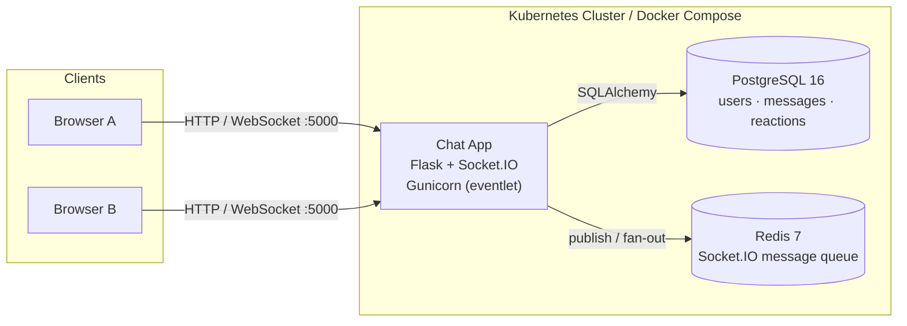

# ChatSpace — Real-Time Messaging App

ChatSpace is a real-time messaging application built with **Python, Flask, and Socket.IO**, backed by **PostgreSQL** and scaled with a **Redis** message queue. It is fully containerized with Docker and deploys to Kubernetes.

## Features

- Real-time messaging with Socket.IO (Redis-backed message queue for multi-replica scaling)
- User registration and login (hashed passwords)
- Public room messages, direct messages, and @mentions with notifications
- Message reactions (toggleable emoji), edit, and delete
- Typing indicators and user online status
- User profiles with avatar upload (png/jpg/jpeg/pdf/txt, 5MB limit)
- File sharing in chat (base64 upload, stored server-side)
- Production-ready Gunicorn + Eventlet configuration
- Docker Compose support for local development
- Kubernetes manifests for cluster deployment (app, PostgreSQL, Redis)

## Architecture




### 3. Load the app image into a kind cluster

With the kind CLI:
```
 
  
 
 
kind load docker-image chatspacereal-timemessagingapp-app:latest --name <cluster-name>
 
 

```

Without the kind CLI (manual, node name desktop-control-plane):
```
 
  
 
 
docker save -o chat-app.tar chatspacereal-timemessagingapp-app:latest
docker cp chat-app.tar desktop-control-plane:/chat-app.tar
docker exec desktop-control-plane ctr --namespace=k8s.io images import /chat-app.tar
 
 
```

### 4. Verify
```
 
  
 
 
kubectl get pods
kubectl get svc
kubectl rollout status deployment/chat
 
 

```

All three pods (chat, postgres-0, redis) should reach Running and 1/1 Ready.
### 5. Access the app

kind does not expose NodePorts to the host by default. Use port-forwarding:
```
 
  
 
 
kubectl port-forward svc/chat-app 5000:80
 
 

```

Then open http://localhost:5000 (keep the terminal open while testing).
## Configuration

All configuration is via environment variables:
Variable

Description

Default
SECRET_KEYFlask secret keydev_secret_key
POSTGRES_USERPostgreSQL usernamepostgres
POSTGRES_PASSWORDPostgreSQL passwordpostgres
POSTGRES_HOSTPostgreSQL hostlocalhost
POSTGRES_PORTPostgreSQL port5432
POSTGRES_DBPostgreSQL database namechatapp
REDIS_URLRedis URL for the SocketIO message queueredis://localhost:6379/0
 
 

Keep .env files and production credentials out of source control.
## Production Checklist

- Run behind HTTPS with an ingress controller or reverse proxy for TLS termination.
- Use Kubernetes Secrets (or a dedicated secret manager) for credentials.
- Use persistent volumes for PostgreSQL data.
- Mount a persistent volume for uploads/ if uploaded files must survive pod recreation.
- Scale the app with replicas > 1 — the Redis message queue keeps Socket.IO events consistent across pods.
- Sticky sessions at the ingress/proxy layer are recommended for Socket.IO with multiple replicas.

## Security Notes

- Never commit .env files or real database credentials.
- k8k/secret.yml must contain placeholders only.
- User uploads are stored outside Git (uploads/ is ignored).
- Uploads are restricted by extension and 5MB size limit.

## License

Private project. Add an appropriate license before distributing or open-sourcing.
